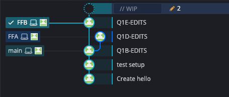

Question 1:  
Github link: https://github.com/ngamihimihi/DATA501_AGM1/  

Question 1.a:  
git init  

cd /Users/nghec/DATA501/Assignment1/DATA501_AGM1   

git clone https://github.com/ngamihimihi/DATA501_AGM1.git  

cd /Users/nghec/DATA501/Assignment1/DATA501_AGM1  

```{r}
library(Rcpp)

# Last 3 digit of your student id 
student_number <- 100

cppFunction('double my_function_A(Rcpp::NumericVector x) {
  int n = x.size();
  if (n < 2) {
    Rcpp::stop("Need at least two elements to compute sample variance");
  }
  
  double mean = Rcpp::mean(x);
  double sum_sq_diff = 0.0;
  
  for (int i = 0; i < n; ++i) {
    sum_sq_diff += (x[i] - mean) * (x[i] - mean) * (x[i] - mean);
  }
  
  return sum_sq_diff / (n + 1);
}')


cppFunction('double my_function_B(Rcpp::NumericVector x) {
  int n = x.size();
  if (n < 2) {
    Rcpp::stop("Need at least two elements to compute the mean");
  }
  double sum_total = 0;
  
  for (int i = 0; i < n; ++i) {
    sum_total += x[i] + 1;
  }
  
  return sum_total / (n-1);
}')


# Read from Data-set
sample2 <- read.csv(paste("Data501_Dataset_Assignment1.csv")) + student_number


# Convert to the correct format
sample3 <- as.numeric(sample2[[1]])


# Test my_function A
valA <- my_function_A(sample3)


# Test my_function B
valB <- my_function_B(sample3)


# Create Output
print(paste("Function A Results: ",  my_function_A(sample3)))
print(paste("Function B Results: ",  my_function_B(sample3)))


print(paste("Mean: ",  mean(sample3)))
print(paste("Variance: ",  var(sample3)))

```

Question 1.b:  
I downloaded the 2 files to my laptop and added to the local folder

git add .
git commit -m"Q1B-EDITS"  
git push  

```{r}
library(Rcpp)
# Last 3 digit of your student id 
student_number <- 544

cppFunction('double my_function_A(Rcpp::NumericVector x) {
  int n = x.size();
  if (n < 2) {
    Rcpp::stop("Need at least two elements to compute sample variance");
  }
  
  double mean = Rcpp::mean(x);
  double sum_sq_diff = 0.0;
  
  for (int i = 0; i < n; ++i) {
    sum_sq_diff += (x[i] - mean) * (x[i] - mean) * (x[i] - mean);
  }
  
  return sum_sq_diff / (n);
}')


cppFunction('double my_function_B(Rcpp::NumericVector x) {
  int n = x.size();
  if (n < 2) {
    Rcpp::stop("Need at least two elements to compute the mean");
  }
  double sum_total = 0;
  
  for (int i = 0; i < n; ++i) {
    sum_total += x[i] + 1;
  }
  
  return sum_total / (n);
}')


# Read from Data-set
sample2 <- read.csv(paste("Data501_Dataset_Assignment1.csv")) + student_number


# Convert to the correct format
sample3 <- as.numeric(sample2[[1]])


# Test my_function A
valA <- my_function_A(sample3)


# Test my_function B
valB <- my_function_B(sample3)


# Create Output
print(paste("Function A Results: ",  my_function_A(sample3)))
print(paste("Function B Results: ",  my_function_B(sample3)))


print(paste("Mean: ",  mean(sample3)))
print(paste("Variance: ",  var(sample3)))

```

Question 1.c:  

git branch FFA
git commit -m"Q1C-EDITS"  

git push -u origin FFA  
git push  
git branch FFB  
git commit-m"Q1C-EDITS"  
git push -u origin FFB  
git push  

```{r}
library(Rcpp)

# Last 3 digit of your student id 
student_number <- 544

cppFunction('double my_function_A(Rcpp::NumericVector x) {
  int n = x.size();
  if (n < 2) {
    Rcpp::stop("Need at least two elements to compute sample variance");
  }
  
  double mean = Rcpp::mean(x);
  double sum_sq_diff = 0.0;
  
  for (int i = 0; i < n; ++i) {
    sum_sq_diff += (x[i] - mean) * (x[i] - mean) * (x[i] - mean);
  }
  
  return sum_sq_diff / (n);
}')


cppFunction('double my_function_B(Rcpp::NumericVector x) {
  int n = x.size();
  if (n < 2) {
    Rcpp::stop("Need at least two elements to compute the mean");
  }
  double sum_total = 0;
  
  for (int i = 0; i < n; ++i) {
    sum_total += x[i] + 1;
  }
  
  return sum_total / (n);
}')


# Read from Data-set
sample2 <- read.csv(paste("Data501_Dataset_Assignment1.csv")) + student_number


# Convert to the correct format
sample3 <- as.numeric(sample2[[1]])


# Test my_function A
valA <- my_function_A(sample3)


# Test my_function B
valB <- my_function_B(sample3)


# Create Output
print(paste("Function A Results: ",  my_function_A(sample3)))
print(paste("Function B Results: ",  my_function_B(sample3)))


print(paste("Mean: ",  mean(sample3)))
print(paste("Variance: ",  var(sample3)))
```
Question 1.d:  

git switch FFA  
git add .  
git commit -m"Q1D-EIDTS"  
git 


```{r}
library(Rcpp)

# Last 3 digit of your student id 
student_number <- 544

cppFunction('double my_function_A(Rcpp::NumericVector x) {
  int n = x.size();
  if (n < 2) {
    Rcpp::stop("Need at least two elements to compute sample variance");
  }
  
  double sum_total = 0;
  
  for (int i = 0; i < n; ++i) {
    sum_total += x[i] + 1;
  }
  
  return sum_total / (n);
}')


cppFunction('double my_function_B(Rcpp::NumericVector x) {
  int n = x.size();
  if (n < 2) {
    Rcpp::stop("Need at least two elements to compute the mean");
  }
  double sum_total = 0;
  
  for (int i = 0; i < n; ++i) {
    sum_total += x[i] + 1;
  }
  
  return sum_total / (n);
}')


# Read from Data-set
sample2 <- read.csv(paste("Data501_Dataset_Assignment1.csv")) + student_number


# Convert to the correct format
sample3 <- as.numeric(sample2[[1]])


# Test my_function A
valA <- my_function_A(sample3)


# Test my_function B
valB <- my_function_B(sample3)


# Create Output
print(paste("Function A Results: ",  my_function_A(sample3)))
print(paste("Function B Results: ",  my_function_B(sample3)))


print(paste("Variance: ",  mean(sample3)))
print(paste("Variance: ",  var(sample3)))
```

Question 1.e:  
git switch FFB  
git add .
git commit -m"Q1E-EDITS"
git push

```{r, echo=FALSE}

library(Rcpp)

# Last 3 digit of your student id 
student_number <- 544

cppFunction('double my_function_A(Rcpp::NumericVector x) {
  int n = x.size();
  if (n < 2) {
    Rcpp::stop("Need at least two elements to compute sample variance");
  }
  
  double mean = Rcpp::mean(x);
  double sum_sq_diff = 0.0;
  
  for (int i = 0; i < n; ++i) {
    sum_sq_diff += (x[i] - mean) * (x[i] - mean) * (x[i] - mean);
  }
  
  return sum_sq_diff / (n);
}')


cppFunction('double my_function_B(Rcpp::NumericVector x) {
  int n = x.size();
  if (n < 2) {
    Rcpp::stop("Need at least two elements to compute the mean");
  }
 double mean = Rcpp::mean(x);
  double sum_sq_diff = 0.0;
  
  for (int i = 0; i < n; ++i) {
    sum_sq_diff += (x[i] - mean) * (x[i] - mean) * (x[i] - mean);
  }
  
  return sum_sq_diff / (n);
}')


# Read from Data-set
sample2 <- read.csv(paste("Data501_Dataset_Assignment1.csv")) + student_number


# Convert to the correct format
sample3 <- as.numeric(sample2[[1]])


# Test my_function A
valA <- my_function_A(sample3)


# Test my_function B
valB <- my_function_B(sample3)


# Create Output
print(paste("Function A Results: ",  my_function_A(sample3)))
print(paste("Function B Results: ",  my_function_B(sample3)))


print(paste("Mean: ",  mean(sample3)))
print(paste("Mean: ",  var(sample3)))
```

Question 1.f:
```{r pressure, echo=FALSE, fig.cap="REPO structure", out.width = '50%'}

```

Question 1.g:  
git add .  
git commit -m"Save markdown progress"  
git push  
git switch main
git rebase FFA  
git commit -m"Q1G-EDITS"  
git push  

```{r}
library(Rcpp)

# Last 3 digit of your student id 
student_number <- 544

cppFunction('double my_function_A(Rcpp::NumericVector x) {
  int n = x.size();
  if (n < 2) {
    Rcpp::stop("Need at least two elements to compute sample variance");
  }
  
  double sum_total = 0;
  
  for (int i = 0; i < n; ++i) {
    sum_total += x[i] + 1;
  }
  
  return sum_total / (n);
}')


cppFunction('double my_function_B(Rcpp::NumericVector x) {
  int n = x.size();
  if (n < 2) {
    Rcpp::stop("Need at least two elements to compute the mean");
  }
  double sum_total = 0;
  
  for (int i = 0; i < n; ++i) {
    sum_total += x[i] + 1;
  }
  
  return sum_total / (n);
}')


# Read from Data-set
sample2 <- read.csv(paste("Data501_Dataset_Assignment1.csv")) + student_number


# Convert to the correct format
sample3 <- as.numeric(sample2[[1]])


# Test my_function A
valA <- my_function_A(sample3)


# Test my_function B
valB <- my_function_B(sample3)


# Create Output
print(paste("Function A Results: ",  my_function_A(sample3)))
print(paste("Function B Results: ",  my_function_B(sample3)))


print(paste("Variance: ",  mean(sample3)))
print(paste("Variance: ",  var(sample3)))

```

Question 1.h.: 
git switch main
git merge FFB --no-commit

resolve conflict

git add Assignment1.Rmd  
git add DATA501_Assignment1.Rmd  
git commit -m"Q1H-EDITS"  
git push  

```{r}
library(Rcpp)

# Last 3 digit of your student id 
student_number <- 544

cppFunction('double my_function_A(Rcpp::NumericVector x) {
  int n = x.size();
  if (n < 2) {
    Rcpp::stop("Need at least two elements to compute sample variance");
  }
  
  double mean = Rcpp::mean(x);
  double sum_sq_diff = 0.0;
  
  for (int i = 0; i < n; ++i) {
    sum_sq_diff += (x[i] - mean) * (x[i] - mean) * (x[i] - mean);
  }
  
  return sum_sq_diff / (n);
}')


cppFunction('double my_function_B(Rcpp::NumericVector x) {
  int n = x.size();
  if (n < 2) {
    Rcpp::stop("Need at least two elements to compute the mean");
  }
 double mean = Rcpp::mean(x);
  double sum_sq_diff = 0.0;
  
  for (int i = 0; i < n; ++i) {
    sum_sq_diff += (x[i] - mean) * (x[i] - mean) * (x[i] - mean);
  }
  
  return sum_sq_diff / (n);
}')


# Read from Data-set
sample2 <- read.csv(paste("Data501_Dataset_Assignment1.csv")) + student_number


# Convert to the correct format
sample3 <- as.numeric(sample2[[1]])


# Test my_function A
valA <- my_function_A(sample3)


# Test my_function B
valB <- my_function_B(sample3)


# Create Output
print(paste("Function A Results: ",  my_function_A(sample3)))
print(paste("Function B Results: ",  my_function_B(sample3)))


print(paste("Mean: ",  mean(sample3)))
print(paste("Mean: ",  var(sample3)))
```

Question 1.i:  
git remote remove origin  
git remote add https://github.com/ngamihimihi/DATA501_AGM1
git remote -v  
git push -u origin main  
git push -u origin FFB  
git push -u origin FFA  
git add Assignment1.pdf  
git commit -m"Add pdf file"  
git push  

Question 2:   
Github link:  
https://github.com/ngamihimihi/DATA501_AGM1P2